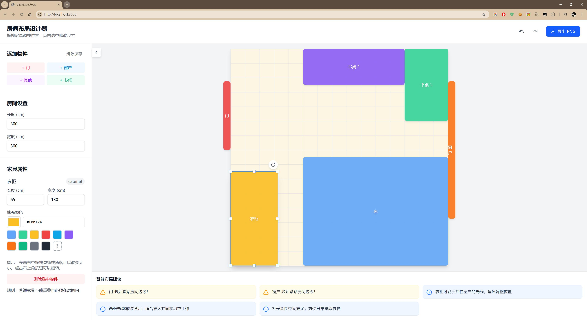

# 房间布局设计器

一个基于 React + TypeScript + Vite 的可视化房间布局设计工具，支持拖拽、缩放、旋转家具，并提供智能布局建议。

## 功能特性

- 可视化拖拽：通过鼠标或触摸拖拽家具调整位置
- 实时缩放：拖拽家具边缘或角落调整尺寸
- 旋转功能：点击旋转按钮将家具旋转 90 度
- 网格吸附：自动对齐到 5cm 网格，方便精确布局
- 智能建议：实时检测家具重叠、越界、布局合理性等问题
- 撤销/重做：支持历史记录管理
- 自动保存：布局数据自动保存到浏览器本地存储
- 导出 PNG：一键导出房间布局图片

## 技术栈

- React 19
- TypeScript 5.8
- Vite 6.2
- Tailwind CSS 4.1
- Lucide React (图标库)
- html2canvas (图片导出)

## 快速开始

### 安装依赖

```bash
npm install
```

### 启动开发服务器

```bash
npm run dev
```

访问 http://localhost:3000 查看应用

### 构建生产版本

```bash
npm run build
```

### 预览生产构建

```bash
npm run preview
```

## 项目结构

```
src/
├── components/
│   ├── RoomCanvas.tsx      # 房间画布组件（拖拽、缩放、旋转）
│   ├── Sidebar.tsx         # 侧边栏组件（添加家具、属性编辑）
│   └── AdvicePanel.tsx     # 建议面板组件（智能布局建议）
├── utils/
│   └── geometry.ts         # 几何计算工具（碰撞检测、布局规则）
├── types.ts                # TypeScript 类型定义
├── App.tsx                 # 主应用组件
├── main.tsx                # 应用入口
└── index.css               # 全局样式
```

## 使用说明

### 添加家具

点击左侧边栏的"添加物件"按钮，选择门、窗户、书桌或自定义物件。

### 调整位置

在画布中拖拽家具即可移动位置，自动吸附到 5cm 网格。

### 调整尺寸

选中家具后，拖拽边缘或角落的白色手柄调整尺寸。

### 旋转家具

选中家具后，点击右上角的旋转按钮，每次旋转 90 度。

### 修改属性

选中家具后，在左侧边栏可以修改长度、宽度、颜色等属性。

### 布局规则

- 门窗必须紧贴房间边缘（允许部分超出）
- 普通家具不能重叠且必须完全在房间内
- 床建议靠墙放置以增加安全感
- 衣柜门前需要至少 60cm 的开门空间

## 智能建议系统

系统会实时检测以下问题并给出建议：

- 家具重叠检测
- 家具越界检测
- 门被遮挡警告
- 窗户采光建议
- 床靠墙建议
- 衣柜开门空间检查
- 双人书桌协作建议

## 效果图


# room-layout-designer
